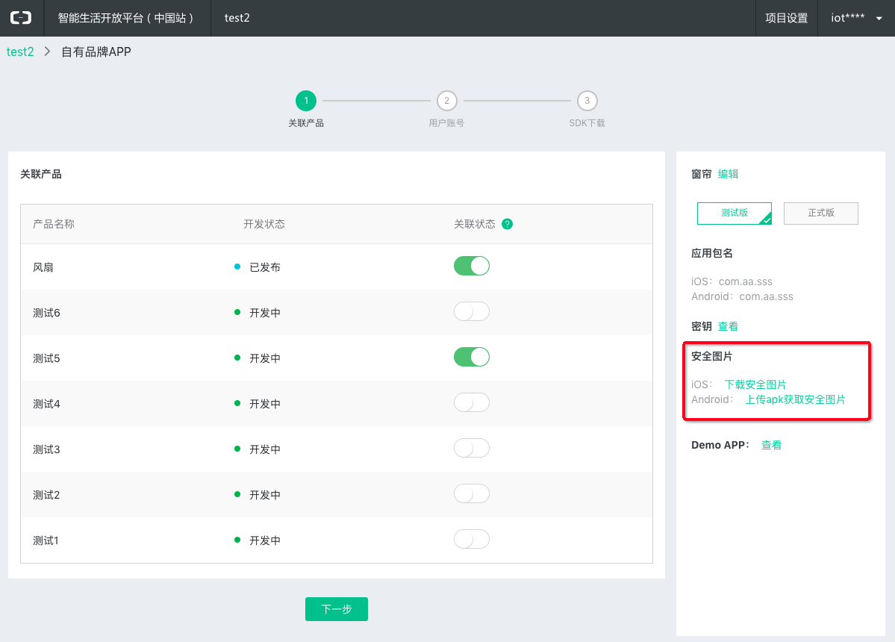
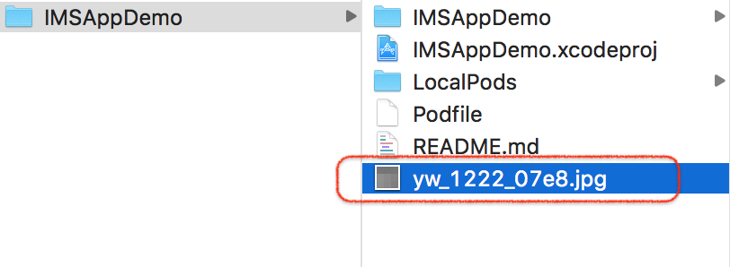
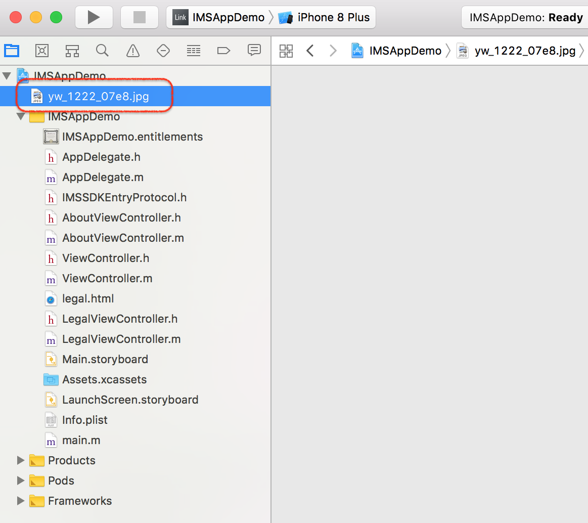

# iOS ESP-Mesh

This App is used to control ESP device run [ESP-MDF](https://github.com/espressif/esp-mdf)

## 1. Include the SDK for aliyun in an Existing Application

1.The aliyun SDK for Application is available through CocoaPods. If you have not installed CocoaPods, install CocoaPods by running the command:

```
 $ gem install cocoapods
 $ pod setup
```

Depending on your system settings, you may have to use sudo for installing cocoapods as follows:

```
 $ sudo gem install cocoapods
 $ pod setup
```
2.In the project root directory  (../EspMeshForiOS) run the following command:

```
 $ pod install
```

## 2. Aliyun SDk initialization requires authentication of the security picture

### 2.1 Secure image acquisition method

<div align=center>
	
</div>

### 2.1 Security picture integration

The file name of the downloaded security picture is yw_1222_07e8.jpg, Please put it in the project root directory, Drag it into the xcodeproj root directory, As shown in the following two figures:

* The security picture is in the project root directory

<div align=center>
	
</div>

* The security picture is in the xcodeproj root directory

<div align=center>
	
</div>

* security in project iOS, The security image needs to be paired with the application bundleID, Make sure the bundleID of the project is the same as the bundleID (package name) you entered when you created appKey on the platform.

### 2.3 Aliyun SDK initialization

After the security picture integration is successful, In the project AppDelegate.m file

```
#import "ESPAliyunSDKInit.h"
```

In didFinishLaunchingWithOptions method to implement initialization ali cloud SDK

```
ESPAliyunSDKInit *HandleTool = [[ESPAliyunSDKInit alloc]init];
[HandleTool LongLinksHandleToolInit];
```

### 2.4 Troubleshoot problems

* Run project crash after access，Error *** Terminating app due to uncaught exception 'com.openaccount.SecurityGuard.SECURITY_PICTURE_NOT_FOUND', reason: '(null)'

1. Check that the bundleID entered when the application was created is the same as the current project bundleID

2. Is the security picture in the project root directory and the xcodeproj root directory

## 3. Development Documents
- App Loacl API: see [localApi](EspMeshApis/ESPMeshLocalApi_en.md)
- App Aliyun API: see [aliyunApi](EspMeshApis/ESPMeshAliyunApi_en.md)
- Protocol: see [protocol](https://docs.espressif.com/projects/esp-mdf/en/latest/api-guides/mlink.html)

## 4. Change Log
- See [log](log/updatelog-en.md)

## 5. License
- See [license](ESPRESSIF_MIT_LICENSE)
